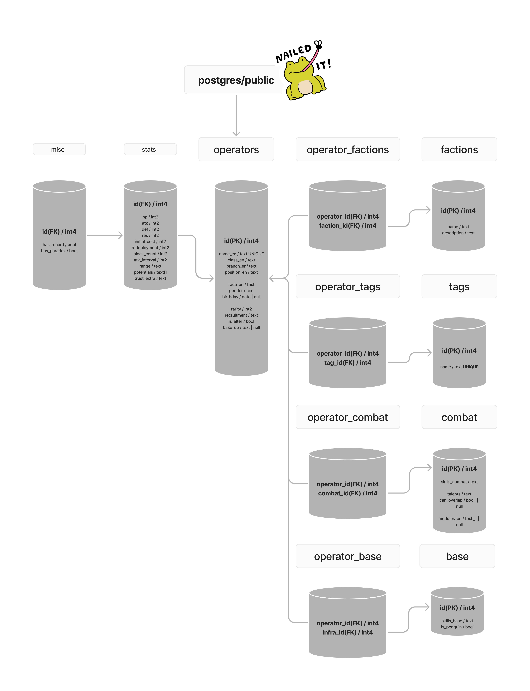
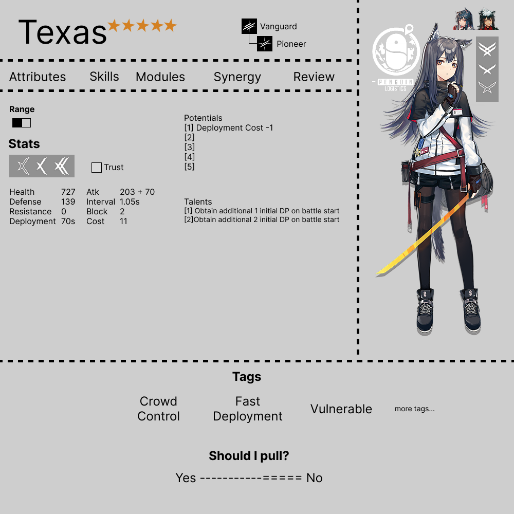

# ArknightsWiki

Greetings Doctor!\
Currently under construction.👷‍♂️🔨🚧

## Tools


## Architecture

### Routing

```
                    home
                     |
    -----------------------------------------
    |          |          |                 |
/operators    /tierlist   /infrastructure   /materials
    |
  [name]
```

### DB



## Features

### React

[] Language Support

_Home_

```
[] Sticky navigation
  [] With opacity
[] Event Banners
  [] Carousel with swiper
[] Better footer
```

_Operators_

```
\\ Overview
[] View with class grouping
[x] Filter by category
  [] name
  [x] rarity
  [x] class
    [] branch?
  [x] faction
[] Refactor with react-query for caching

\\ Details
[x] Tab Selection(useState)
[] Faction fetching
[] Tags | Votes(to draw or not)
  [] Votes could be represented in shpae of rope fight
```

_Infra_

```
[] Query operators JOIN base
  [] When an operator is selected, filter view to its realtions
[] ?Save preset
```

### CSS

_Home_

```
[] Banners(Carousel)
[] Footer
  [] Make it stick to the bottom
```

_Operators_Grid_

```
[] Grid(_grid.scss)
  [] 6 repeated columns
  [] when hovered, the icon shines according to its rarity
  [] Dropdown rarity bar to show/hide corresponding operators
[] Modal
  [] when hovered, a preview pops up as a modal
[]
```

_Operators_Details_


```
[]
```

_Tierlist_

_Base_

### DB

_Operators_
[] UPDATE COLUMN name_en TO name

### Deploy

```
[]
```
