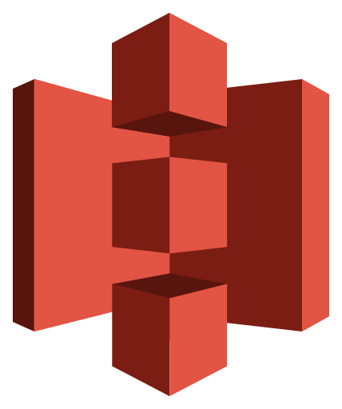

# ArknightsWiki


Greetings, Doctor!\
This is the source page of [Rhodes Island](https://arknights-wiki.vercel.app/).\
I've poured lots of time and love into making this happen.\
Feel free to browse and reference it as you like🥰\
Thanks for visiting!

## Features

### Wiki

-   Filter infrastructure skills by categorized effects
-   Advanced filtering by rarity, class, branch, faction, limited status, alter status, recruit type, and more
-   Voting features for quick operator feedback, implemented with debouncing and optimistic UI

TODO:

-   Modals for easy lookup of related operators, factions, and effects

### Tech

-   Static site with server-side rendering (SSR) and hydration for efficient pagination
-   Caching with React hooks and Zustand store for optimized client performance

TODO:

-   Implement i18n support in 5 languages (to reach a global audience)
-   Add custom image optimization and loader powered by AWS Lambda(to reduce cost)
-   Enable incremental Static Regeneration (ISR) to keep data fresh without full rebuilds
-   Build end-to-end data update pipeline using GitHub Actions and PyMongo

## Architecture

TODO: Add architecture diagram here

```
                    app
                     |
    --------------------------
    |          |             |
/operators   /infra      (...others)
    |
  [name]
```

### Testing

-   Unit tests with Jest

TODO:

-   Add integration tests
-   Set up E2E tests with Cypress
-   Integrate test runs into CI pipeline

## Tools

### Frontend


-   Next.js
-   TypeScript
-   PandaCSS (build-time CSS-in-JS styling)
-   Radix UI (headless UI primitives)
-   Zustand (state management)
-   Jest (unit testing)

### Backend



<!--  -->

-   Supabase (auth & database service)
-   OAuth 2.0 (third-party authentication)
-   AWS S3 (asset storage)
<!-- -   AWS Lambda (custom image optimization) -->

### Data


-   PostgreSQL (via Supabase)
-   MongoDB (for game data)
-   Python (data processing pipeline)

### Deploy


-   GitHub (CI/CD & version control)
-   Vercel (static site hosting)

## Initial Designs


